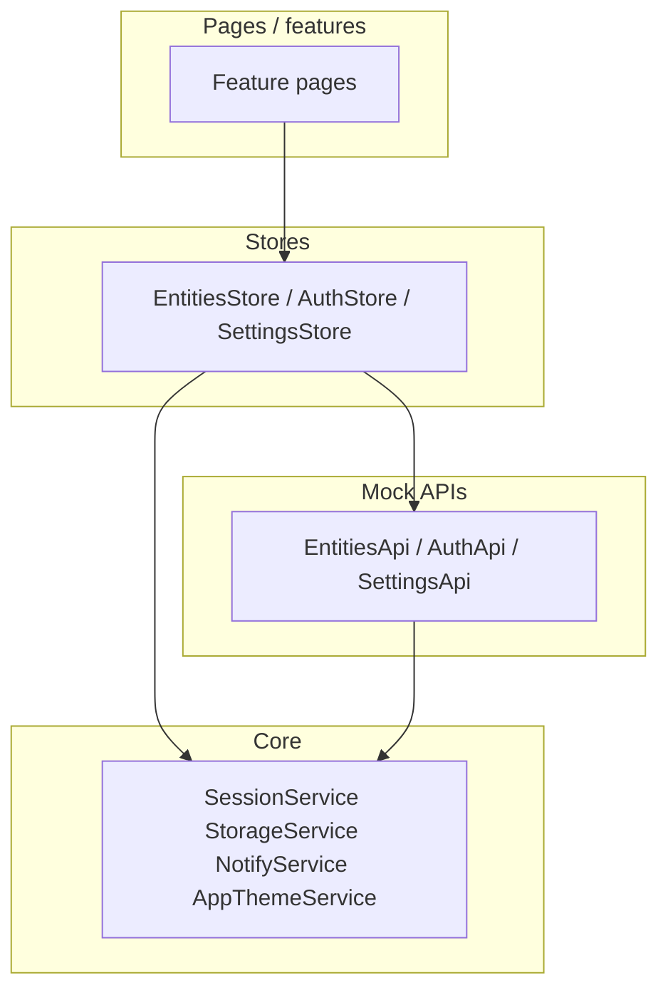

# Nexir Core Workspace — specyfikacja pełna (1:1) i przewodnik migracji do React

**Przeznaczenie:** jeden dokument dla agenta / zespołu, który **odtwarza całą aplikację** w React bez zgadywania. Obejmuje: **funkcje**, **widoki i wygląd**, **architekturę Angular**, **złożoność**, **kontrakty danych**, **mapowanie na React** oraz **propozycję struktury repo** pod skalowalność i czytelność.

**Stack docelowy (referencyjny):** React 19.2 · Vite 8 · React Router 7 · MUI v9 · TanStack Query v5 · Zustand · React Hook Form · Zod 4 · Storybook ~10 · TypeScript · ESLint · Prettier.

**Dokumenty pomocnicze:** dosłowny copy na ekranach — [APP_UI_SPEC.md](./APP_UI_SPEC.md); krótki przegląd repo — [README.md](../README.md).

**Implementacja React:** repozytorium `nexir-flow-workspace` w tym workspace jest docelową aplikacją React zbudowaną według tej specyfikacji (Nexir Flow — branding produktowy).

---

## Spis treści

1. [Zakres i poziom złożoności](#1-zakres-i-poziom-złożoności)
2. [Zasady architektury Angular (obecny stan)](#2-zasady-architektury-angular-obecny-stan)
3. [Mapowanie na architekturę React (cel)](#3-mapowanie-na-architekturę-react-cel)
4. [Drzewo katalogów Angular — co gdzie leży](#4-drzewo-katalogów-angular--co-gdzie-leży)
5. [Propozycja drzewa katalogów React](#5-propozycja-drzewa-katalogów-react)
6. [System wizualny (jak to wygląda „wszędzie”)](#6-system-wizualny-jak-to-wygląda-wszędzie)
7. [Routing, guardy, providery](#7-routing-guardy-providery)
8. [Persistence i kontrakty localStorage](#8-persistence-i-kontrakty-localstorage)
9. [Modele domenowe i walidacje](#9-modele-domenowe-i-walidacje)
10. [Warstwa mock API — zachowania i opóźnienia](#10-warstwa-mock-api--zachowania-i-opóźnienia)
11. [Stan aplikacji: kto co trzyma](#11-stan-aplikacji-kto-co-trzyma)
12. [Logika czysta (do przeniesienia 1:1 + testy)](#12-logika-czysta-do-przeniesienia-11--testy)
13. [Ekran po ekranie: funkcja + układ + copy](#13-ekran-po-ekranie-funkcja--układ--copy)
14. [Komponenty UI współdzielone (design system)](#14-komponenty-ui-współdzielone-design-system)
15. [Encje: katalog, tabela, toolbar](#15-encje-katalog-tabela-toolbar)
16. [Powiadomienia (Snackbar) — pełna lista](#16-powiadomienia-snackbar--pełna-lista)
17. [Storybook — spis](#17-storybook--spis)
18. [Testy i jakość](#18-testy-i-jakość)
19. [Motyw kolorystyczny w React (propozycja odrębna)](#19-motyw-kolorystyczny-w-react-propozycja-odrębna)
20. [Plan wdrożenia fazami (jeden zamach, sensowna kolejność)](#20-plan-wdrożenia-fazami-jeden-zamach-sensowna-kolejność)
21. [Master checklist dla agenta](#21-master-checklist-dla-agenta)

---

## 1. Zakres i poziom złożoności

| Obszar | Złożoność | Uwagi |
|--------|-----------|--------|
| **Auth (login/register/logout)** | Niska | Proste formularze, mock registry, sesja w storage. |
| **Guards** | Niska | Dwa stany: gość vs zalogowany. |
| **Dashboard** | Niska | Agregacja sesji + licznik encji + recent + linki. |
| **Katalog encji** | Średnia | Filtry, sort, wyszukiwarka, paginacja, integracja z ulubionymi, stany loading/error/empty. |
| **Ulubione** | Średnia | Przecięcie zbiorów + te same filtry co katalog + osobne empty states. |
| **Formularz encji** | Średnia | Sekcje, walidatory, sample payload, create vs edit. |
| **Detail encji** | Niska–średnia | Layout sekcji, recent, status tones. |
| **Konto / ustawienia** | Niska | Form + mock API + motyw. |
| **Motyw** | Średnia (integracja) | System/light/dark + gęstość + brak FOUC — w MUI inny mechanizm niż klasy na `<html>`. |

**Motyw przewodni migracji:** ta sama **funkcjonalność** i **UX** (flow, copy, stany brzegowe), nie ten sam kod linijka w linijkę. Architektura React powinna być **jaśniejsza w podziale**: `api/` (mock), `queries/`, `stores/` (minimalne), `features/`, `ui/`.

---

## 2. Zasady architektury Angular (obecny stan)

- **`core/`** — bez importów z `features/`; sesja, storage, guardy, motyw, walidacja haseł, powiadomienia, usługi „cross-cutting” (recent, favorites ids).
- **`shared/`** — layouty publiczne, shell, mapa aplikacji, komponenty UI prefiks `nx-*`, style produktowe (`_product-shell.scss`).
- **`features/<nazwa>/`** — pionowe slice’y: `routes/`, `pages/`, czasem `components/`, `store/`, `data/`, `models/`.
- **Stan:** sygnały (`signal`, `computed`, `effect` tam gdzie trzeba — np. reset strony paginatora).
- **Async:** RxJS + `Observable`; opóźnienia `timer`/`delay` symulują sieć.
- **DI:** część serwisów `providedIn: 'root'`; **AuthStore + AuthApi** oraz niektóre store’y **na poziomie routy** (nowa instancja per „branch” routingu tam, gdzie dodano `providers`).

**Zależności między warstwami (idea):**



---

## 3. Mapowanie na architekturę React (cel)

| Koncepcja Angular | Odpowiednik React (rekomendowany) |
|-------------------|-----------------------------------|
| `Routes` + lazy load | `createBrowserRouter`, `lazy()`, `Suspense` przy layoutach |
| `canActivate` | `loader` z odczytem sesji z storage / moduł `auth-guard.ts` zwracający `redirect` |
| `providers` na routach | **Unikaj** duplikacji: jeden moduł `auth` z hookami + Query; ewentualnie Context tylko dla sesji |
| `signal` / `computed` | Zustand `subscribeWithSelector` + selektory **albo** `useMemo` nad `useQuery` |
| `EntitiesStore` (global) | **Query:** lista i szczegóły encji; **Zustand:** wyłącznie `searchQuery`, `filters`, `sort` (UI katalogu) — żeby Entities i Favorites dzieliły stan **bez** context drillingu |
| RxJS w API | Funkcje `async` z `await delay(ms)` — identyczne efekty |
| Reactive Forms | RHF + schematy Zod (jeden plik `entityFormSchema` obok `entity-form.ts`) |
| Angular Material | MUI v9 — **Card, AppBar, Drawer, DataGrid lub Table**, Snackbar/Alert, TextField Select |
| `AppThemeService` + klasy na `<html>` | MUI `ThemeProvider`, `createTheme`, `palette.mode`, `components.MuiButton.defaultProps` jeśli trzeba; „system” = `useMediaQuery('(prefers-color-scheme: dark)')` |
| `NotifyService` | Hook `useNotify()` + kolejka lub pojedynczy stan; style: `Snackbar` + `Alert` severity |

**Czytelność:** trzymaj **mock** w `src/mocks/` lub `src/api/mock/` **bez** Reacta; **hooki** tylko cienkie opakowania nad Query; **strony** tylko kompozycja.

---

## 4. Drzewo katalogów Angular — co gdzie leży

Skrót rzeczywistej struktury `src/app/` (najważniejsze pliki):

```
src/app/
├── app.config.ts              # Router, animacje, SnackBar, APP_INITIALIZER → motyw
├── app.routes.ts              # Top-level routes, lazy, guards
├── core/
│   ├── app-theme.service.ts
│   ├── favorite-entities.service.ts
│   ├── guards/ auth.guard.ts, guest.guard.ts
│   ├── notify.service.ts
│   ├── password-rules.ts
│   ├── recent-entities.service.ts
│   ├── session.model.ts
│   ├── session.service.ts
│   ├── storage-keys.ts
│   └── storage.service.ts
├── shared/
│   ├── layout/                # landing, app-map, app-shell
│   ├── meta/ protected-paths.ts
│   ├── styles/ _product-shell.scss
│   └── ui/                    # section-card, empty-state, shell-nav-item, status-badge, info-panel, entity-list-item
└── features/
    ├── auth/ data/auth.api.ts, store/auth.store.ts, routes/login|register.routes.ts, pages/login|register
    ├── dashboard/ routes, pages, store/dashboard.store.ts
    ├── entities/ routes, pages (list, create, edit, detail, layouts, shell), components (toolbar, table, form-fields),
    │            catalog/ filter + constants, data/mock-entities + entities.api, forms/entity-form.ts, store/entities.store.ts
    ├── favorites/ routes, pages
    ├── account/ routes, pages
    └── settings/ data, store, pages, models/preferences
```

**Puste layouty:** `EntitiesLayoutComponent` i `EntityShellComponent` to tylko `<router-outlet />` — w React można je pominąć na rzecz zagnieżdżonych tras w jednym pliku routingu.

---

## 5. Propozycja drzewa katalogów React

Cel: **feature-first**, **flat gdzie sensownie**, testy i stories obok komponentów.

```
src/
├── main.tsx
├── app/
│   ├── router.tsx                 # createBrowserRouter — jedna tablica tras
│   ├── providers.tsx              # QueryClientProvider, ThemeProvider, optional Zustand Provider
│   └── layout/
│       ├── AppShellLayout.tsx
│       ├── PublicLayout.tsx
│       └── WorkspaceLanding.tsx
├── core/
│   ├── storage/
│   │   ├── keys.ts              # te same stringi co STORAGE_KEYS
│   │   └── localStorage.ts
│   ├── session/
│   │   ├── sessionStore.ts      # Zustand lub hook + persist middleware
│   │   └── types.ts
│   ├── theme/
│   │   ├── theme.ts
│   │   └── useThemePreferences.ts
│   ├── notify/
│   │   └── useNotify.ts
│   └── validation/
│       └── password.ts          # port password-rules
├── api/
│   ├── mock/
│   │   ├── delay.ts
│   │   ├── auth.ts
│   │   ├── entities.ts
│   │   └── settings.ts
│   └── types/                   # wspólne typy jak EntityRecord
├── queries/
│   ├── keys.ts
│   ├── entities.ts
│   └── settings.ts
├── stores/
│   └── entityCatalogUiStore.ts  # filtry + sort (współdzielone Entities + Favorites)
├── features/
│   ├── auth/
│   ├── dashboard/
│   ├── entities/
│   ├── favorites/
│   ├── account/
│   └── settings/
├── ui/                            # MUI wrappers + nx-parity components
└── styles/
    └── global.css
```

---

## 6. System wizualny (jak to wygląda „wszędzie”)

### 6.1 Globalnie

- **Tło:** gradient „szary” (`body`) + subtelny radial accent — zdefiniowane w `styles.scss` jako `--nx-app-bg` / `--nx-app-bg-accent` (dark vs light).
- **Karty / powierzchnie:** klasa **`nx-product-surface`** (albo odpowiednik MUI: `Card` z podniesionym cieniem, border-radius **~14px**). W środku: lekko jaśniejszy/cieplejszy ton niż tło strony.
- **Treść strony produktowej:** kontener **`.nx-product-page`** — `max-width: 1040px`, wyśrodkowany, padding pionowy ~2.5rem, **kolumna** z odstępami ~1.75rem między sekcjami.
- **Tytuły:** `.nx-page-title` — styl headline-small (MUI `Typography variant="h4"` lub custom); **`.nx-page-subtitle`** — body large, kolor `onSurfaceVariant`, max-width ~42rem.
- **Tekst wtórny:** `.nx-muted` — `on-surface-variant`, body medium.

### 6.2 Shell (`/app/*`)

- **Sidenav:** szeroki panel po lewej, brand **„Nexir Core Workspace”**, linia oddzielająca, lista: Dashboard, Entities, Favorites, Settings; na dole **Account**. Aktywny link: delikatne tło z mix primary + przezroczystość (jak `shell-nav-item--active`).
- **Toolbar:** primary color, ikona menu, tytuł **„Workspace”**, po prawej **Sign out** (text button).
- **Main:** jedna kolumna pod outletem; zawartość zwykle w `.nx-product-page`.

### 6.3 Auth (login / register)

- Wyśrodkowana **jedna karta** (`outlined`), wąska kolumna (max-width typu ~440px), pola **outline** Material, ikony prefix przy email/hasło.
- Przycisk primary na dole formularza; pod spodem link **Back to overview** do `/`.

### 6.4 Lista encji i ulubione

- **Nagłówek strony:** flex — po lewej tytuł + podtytuł; po prawej przycisk (lista: **New entity**; ulubione: stroked **All entities**).
- **Główny blok:** jedna duża karta:
  - góra: **toolbar** (wyszukiwarka + selecty + sort),
  - **divider**,
  - **tabela** (pełna szerokość karty),
  - **paginator** (show first/last).
- **Wiersz tabeli:** cursor pointer, hover lekki szary mix; nagłówek tabeli nieco „podbarwiony” primary mix (~8%).

### 6.5 Formularz encji (new / edit)

- Nagłówek: back **„Entities”**, tytuł strony, podtytuł.
- **Karta 1 (fields):** `nx-entity-form-fields` — trzy sekcje z tytułami:
  - **Basic information** — Name, Description (textarea 4 wiersze),
  - **Classification** — Status, Category, Priority (selecty),
  - **Ownership** — Owner.
  - Separator sekcji: cienka linia `nx-card-border`, padding pionowy.
- **Karta 2 (actions):** przyciski Cancel, Generate sample data (stroked), primary Save/Create; opcjonalny alert błędu ze store.

### 6.6 Detail encji

- Back link **„Entities”**, H1 nazwa, badge statusu + id obok.
- Przycisk **Edit** (stroked) po prawej w headerze.
- Karty sekcji: Overview (opis + siatka statystyk 2-kolumnowa), Metadata (kafelki), Activity (lista z ikoną historii).

### 6.7 Snackbary

- Pozycja **dół / prawo**; przycisk **Dismiss**; klasy **`nx-snackbar--success|info|error`** — success: mix primary na surface container; error: mix error.

---

## 7. Routing, guardy, providery

### 7.1 Drzewo URL (1:1)

| URL | Komponent / treść |
|-----|-------------------|
| `/` | Landing; **jeśli sesja** → redirect `/app/dashboard` |
| `/workspace-map` | Application map |
| `/login` | Login; **jeśli sesja** → `/app/dashboard` |
| `/register` | Register; **jeśli sesja** → `/app/dashboard` |
| `/app` | redirect → `/app/dashboard` |
| `/app/dashboard` | Dashboard |
| `/app/entities` | Lista |
| `/app/entities/new` | Create |
| `/app/entities/:id` | Detail |
| `/app/entities/:id/edit` | Edit |
| `/app/favorites` | Favorites |
| `/app/account` | Account |
| `/app/settings` | Settings |
| `**` | redirect `/` |

### 7.2 Providery w Angular (ważne przy portowaniu)

| Zakres | Providery |
|--------|-----------|
| Route `/login`, `/register` | `AuthStore`, `AuthApi` |
| Route `/app` | `AuthStore`, `AuthApi` |
| Route `/app/dashboard` | `DashboardStore` |
| Route `/app/settings` | `SettingsStore`, `SettingsApi` |
| Root | `SessionService`, `StorageService`, `EntitiesApi`, `EntitiesStore`, `FavoriteEntitiesService`, `RecentEntitiesService`, `NotifyService`, `AppThemeService`, … |

W React **nie trzeba** powielać „instancji per route” — wystarczy **jeden** store sesji i **jeden** moduł API; ewentualnie osobny `QueryClient`.

---

## 8. Persistence i kontrakty localStorage

Identyczne klucze jak w `storage-keys.ts`:

| Klucz | Zawartość |
|-------|-----------|
| `nexir.session.v1` | `Session \| null` |
| `nexir.users.v1` | `RegisteredUser[]` |
| `nexir.preferences.v1` | `UserPreferences` |
| `nexir.entities.v2` | `EntityRecord[]` — po pierwszym zapisie nadpisuje seed |
| `nexir.recent-entities.v1` | `string[]` — max **6** id, najnowsze na początku |
| `nexir.favorite-entity-ids.v1` | `string[]` — unikalne id |

**StorageService:** SSR-safe (poza przeglądarką no-op); get/set/remove + `getJson`/`setJson`.

---

## 9. Modele domenowe i walidacje

### 9.1 Session

`userId`, `email`, `issuedAt` (number).

### 9.2 Hasło (rejestracja / zmiana hasła)

- **Hint stały:** `At least 8 characters, one uppercase letter, and one digit.`
- **Walidator:** min 8, `[A-Z]`, `\d` — zgodnie z `password-rules.ts` i `validatePasswordStrengthOrThrow` w API.

### 9.3 Login

- Email: required + email.
- Hasło: required + **minLength(4)** — słabszy próg niż rejestracja (świadomie).

### 9.4 Formularz encji (`entity-form.ts`)

| Pole | Reguły |
|------|--------|
| name | required, minLength 2, maxLength 160 |
| description | required, maxLength 4000 |
| status / category / priority | enumy, domyślne draft / general / medium |
| owner | required, maxLength 120 |

Komunikaty błędów w UI (Angular): m.in. „Name is required”, „At least 2 characters”, „Too long”, „Description is required”, „Owner is required”.

### 9.5 Konto (zmiana hasła)

- Pola: current, new (strength), confirm; **grupa** — `newPasswordsMatchValidator`.

---

## 10. Warstwa mock API — zachowania i opóźnienia

| Moduł | Opóźnienie ~ | Uwagi |
|-------|----------------|-------|
| Auth | 280 ms (register/login), logout też async | Register: unikalny email; login: email lower-case |
| Entities | 180 ms | list/get/create/update; create dodaje metadata + activity |
| Settings | 200 ms | merge preferencji |

**Błędy:** treści po angielsku jak w `throwError` w kodzie (np. „Invalid email or password.”, „Record not found.”).

**Seed encji:** plik `mock-entities.ts` — kilka rekordów demo (w projekcie jest **10** wpisów startowych przed zapisem do storage).

---

## 11. Stan aplikacji: kto co trzyma

| Stan | Gdzie w Angular | Co przenieść |
|------|-----------------|---------------|
| Sesja | `SessionService` + storage | Zustand persist **lub** tylko storage + hook |
| Lista + filtry encji | `EntitiesStore` (root) | **Zustand slice** `entityCatalogUi` + **TanStack Query** `['entities']` |
| Wybrana encja (detail) | `EntitiesStore.selectedId`, `selected` | Query `['entities', id]` lub fragment listy |
| Ulubione id | `FavoriteEntitiesService` | Zustand persist lub mały store + storage |
| Recent ids | `RecentEntitiesService` | Funkcje + storage |
| Preferencje | `SettingsStore` + API | Query + invalidacja po save |
| Dashboard copy | `DashboardStore` | `useMemo` z session + entities count |

**Efekt:** Favorites i Entities **muszą** dzielić ten sam stan filtrów — w Angularu jest to jeden `EntitiesStore`; w React **nie** duplikuj dwóch kopii filtrów.

---

## 12. Logika czysta (do przeniesienia 1:1 + testy)

1. **`filterAndSortEntityRecords(rows, state)`** — plik `entity-catalog-filter.ts`: search po name/description/owner/id → status → category → sort (updatedAt / priority / status / name) z mnożnikiem asc/desc.
2. **Generowanie id** `ent-NNN` od max istniejących numerów.
3. **Password rules** — identyczne regexy i komunikaty.
4. **Sample payload** — `getSampleEntityPayload()` stały obiekt spójny semantycznie.

Testy jednostkowe: Vitest/Jest — **bez** React Testing Library dla tych funkcji.

---

## 13. Ekran po ekranie: funkcja + układ + copy

### `/` Landing

- Hero: eyebrow **Nexir Core Workspace**, H1 **Workspace**, podtytuł o neutralnej powłoce.
- CTA: **Sign in**, **Create account**.
- Karta Explore + przycisk **View application map**.
- Karta repo paths — lista z `EXAMPLE_SENSITIVE_PATHS` (label, path, hint).
- Info panel **Access** — tekst o `/app` i sesji.

### `/workspace-map`

- Intro w karcie: tytuł **Application map**, podtytuł, przycisk **Back to our view** → `/`.
- Sekcje: Routes, Inside /app, Code layout, Data & mocks — treść jak w `workspace-app-map-page.component.html`.

### `/login`

- Tytuł **Sign in**; podtytuł z linkiem **Create one** → register.
- Błąd: `store.errorMessage()` pod polami.
- Przycisk: **Signing in…** gdy busy.

### `/register`

- **Create account**; podtytuł z linkiem do login; linia zasad hasła (`PASSWORD_RULES_HINT`).
- **Creating…** przy busy.

### `/app/dashboard`

- Header: **Dashboard** + podtytuł; badge **Session active**.
- Karty: Workspace (podsumowanie sesji + liczba rekordów), Quick actions (5 linków), Recent records (lista lub pusty opis).

### `/app/entities`

- Stany: spinner (gdy loading i brak danych), error + **Retry**, empty **No records** + **Reload**, albo karta z tabelą.
- Podtytuł: search/filter/star/edit — jak w template.

### `/app/favorites`

- Puste: **No favorites yet** + **Go to entities**; lub **No matching favorites** + **Clear filters**; albo tabela z **`favoriteStarFilled`** (gwiazdki wypełnione).

### `/app/entities/new` | `.../edit`

- Tytuły: **New entity** / **Edit entity**; back **Entities** lub **Back** (edit).
- Przyciski: Cancel, Generate sample data, Create entity / Save changes; loading **Saving…**

### `/app/entities/:id`

- Loading / error / treść; po załadowaniu **recordOpened** do recent.
- Sekcje Overview, Metadata, Activity — jak w template detail.

### `/app/account`

- Email użytkownika; formularz haseł; submit **Update password**.

### `/app/settings`

- Karta Appearance: Theme (system/light/dark), Density; **Save preferences** / **Saving…**

---

## 14. Komponenty UI współdzielone (design system)

| Komponent | Rola wizualna |
|-----------|----------------|
| `SectionCard` | `mat-card` outlined, opcjonalny title/subtitle, slot body |
| `EmptyState` | Wyśrodkowanie, duża ikona, tytuł, opis, opcjonalny primary button |
| `StatusBadge` | Chip z tonem neutral / positive / attention |
| `InfoPanel` | Poziomy blok z ikoną info + tytuł + treść |
| `ShellNavItem` | Wiersz nawigacji: ikona + label, stan active |
| `EntityListItem` | Dwa wiersze tekstu (dashboard recent) |

W React: folder `ui/` lub `components/ui/` z prefiksem projektu (np. `NexirSectionCard`).

---

## 15. Encje: katalog, tabela, toolbar

- **Kolumny (kolejność stała):** `favorite`, `name`, `status`, `category`, `priority`, `owner`, `updatedAt`.
- **Paginacja:** opcje **5, 8, 16**; przy zmianie `filteredItems` / `filteredFavoriteRows` → **pageIndex = 0** (effect w Angularze).
- **Toolbar:** bez `@Input` — czyta wyłącznie `EntitiesStore` (single source of truth).
- **Tabela:** `favoriteStarFilled` opcjonalnie true na Favorites; klik wiersza → edit; gwiazdka → toggle + `stopPropagation`.

---

## 16. Powiadomienia (Snackbar) — pełna lista

| Zdarzenie | Typ | Tekst |
|-----------|-----|--------|
| Login | success | `Signed in.` |
| Register | success | `Account created. You are signed in.` |
| Logout | info | `Signed out.` |
| Ulubione dodane (lista) | info | `Added to Favorites.` |
| Ulubione usunięte (lista) | info | `Removed from Favorites.` |
| Ulubione usunięte (favorites) | info | `Removed from Favorites.` |
| Retry katalogu OK | success | `Catalog refreshed.` |
| Create encji | success | `Entity created.` |
| Update encji | success | `Changes saved.` |
| Sample data | info | `Sample values applied to the form.` |
| Ustawienia | success | `Preferences saved.` |
| Konto | success | `Password updated.` |
| Błąd create/update | error | `store.errorMessage()` lub domyślny tekst |

---

## 17. Storybook — spis

- `shared/ui/*` — każdy komponent + Controls + opis Docs.
- `features/entities/components` — **EntityCatalogTable** (warianty Catalog / Favorites filled), **EntityCatalogToolbar**.

---

## 18. Testy i jakość

- Angular: Vitest (`ng test`), ESLint, Prettier.
- React: ten sam poziom — **testy czystej logiki** (filtr, hasło, id), **komponenty krytyczne** (toolbar, tabela) w Storybook + ewentualnie RTL dla formularzy auth.

---

## 19. Motyw kolorystyczny w React (propozycja odrębna)

Angular używa palety **Azure** (Material 3). Dla wersji React można przyjąć **inną tożsamość** przy tym samym układzie:

- **Primary:** Indigo 600 (lub **Teal 700** jeśli chcesz mocniejsze „workspace” feeling).
- **Secondary:** neutralna szarość / **Deep Orange** akcenty wyłącznie na badge „attention” — oszczędnie.
- **Tło:** podobna logika gradientu jak `--nx-app-bg`, ale odcienie dopasowane do MUI `palette`.

Implementacja: `createTheme` + `CssBaseline` + ewentualnie `colorSchemes` (MUI experimental).

---

## 20. Plan wdrożenia fazami (jeden zamach, sensowna kolejność)

1. **Fundament:** Vite, TS strict, router, MUI theme, storage + session restore, guards.
2. **Auth:** login/register/logout + snackbary + user registry.
3. **Shell:** drawer + app bar + outlet.
4. **Entities:** Query list + Zustand filtry + lista + paginacja + toolbar + tabela.
5. **Favorites + gwiazdki** + przecięcie.
6. **Detail + recent** + edit/create + formularze RHF+Zod.
7. **Account + Settings** + motyw.
8. **Dashboard** + landing + workspace map.
9. **Storybook** + polish wizualny + testy logiki.

---

## 21. Master checklist dla agenta

- [ ] Wszystkie ścieżki URL z sekcji 7 działają; redirecty 1:1.
- [ ] Guard: niezalogowany → `/login` dla `/app/*`; zalogowany nie widzi `/login` i `/register`.
- [ ] Landing `/` przekierowuje zalogowanych na dashboard.
- [ ] Klucze localStorage i formaty JSON z sekcji 8.
- [ ] Filtry współdzielone Entities + Favorites; reset strony przy zmianie filtra.
- [ ] Paginator: długość źródła = przefiltrowana lista (lub przecięcie dla favorites).
- [ ] Recent: max 6, deduplikacja, najnowszy na początku.
- [ ] Snackbary z sekcji 16.
- [ ] Walidacje z sekcji 9 (różnica login vs register haseł).
- [ ] Mock opóźnienia i komunikaty błędów jak w Angular.
- [ ] Storybook: UI + katalog encji.
- [ ] `document.title` = Nexir Core Workspace; `lang="en"`.

---

*Ten dokument jest **zamierzenie obszerny**: ma eliminować luki przy przepisywaniu. Jeśli pojawi się rozbieżność między tekstem a kodem Angular, **kod źródłowy** pozostaje źródłem prawdy dla zachowania; copy ekranowe można zestawić z [APP_UI_SPEC.md](./APP_UI_SPEC.md).*
